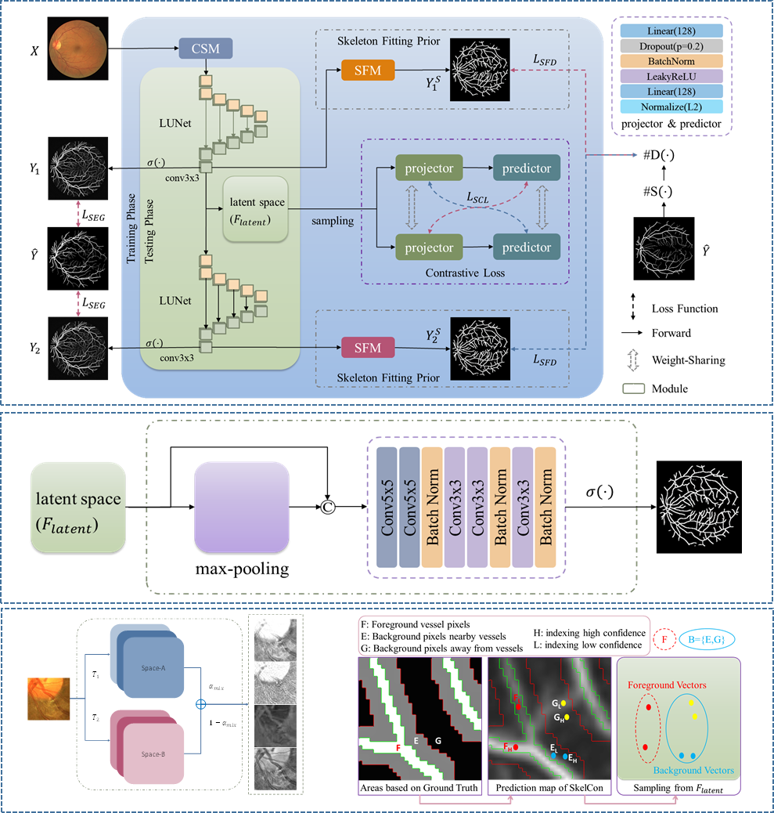

# SkelCon
PyTorch implementation for our paper on TMI2022:    

"Retinal Vessel Segmentation with Skeletal Prior and Contrastive Loss"

## WebPages:
- https://ieeexplore.ieee.org/abstract/document/9740153
- https://www.life.uestc.edu.cn/info/1211/4485.htm


## Method
<!--  -->



## Project


```
Project for SkelCon
    ├── code:core code for contribution in our paper
        ├── color_space_mixture.py (Data Augmentation Method)  
        ├── sample_contrastive_learning.py (Sample Contrastive Learning)  
        ├── model_skelcon.py (Skeletal Prior based Network)  
        └── ...  
    ├── docs (figures)  
        └── ... 
    ├── onnx (trained weights)  
        ├── *.onnx (Pytorch trained weights)  
        ├── infer.py (to extract vessels from fundus images with *.onnx) 
        └── ...     
    ├── proj (package for segmentation with torch)  
        ├── data (to extract datasets)  
        ├── nets (define the network)  
        ├── build.py (define the network)  
        ├── grad.py (for training)  
        ├── loop.py (for training)  
        ├── optim.py (optimizer)  
        ├── main.py   
        └── ...  
    ├── results (segmentation for fundus images on testsets)  
        ├── popular (segmentation results for popular datasets)  
        ├── generalization (segmentation results for cross-dataset-validation)  
        └── ...   
```


And for the training on DRIVE dataset, run the command
```bash
cd proj
python main.py --gpu=1 --db=drive
```


## Contact
For any questions, please contact me. 
And my e-mails are 
-   tyb311@qq.com
-   ybt@std.uestc.edu.cn


## Citation
If you use this codes in your research, please cite the paper:
```BibTex
@article{tan2022retinal,
  title={Retinal Vessel Segmentation with Skeletal Prior and Contrastive Loss},
  author={Tan, Yubo and Yang, Kai-Fu and Zhao, Shi-Xuan and Li, Yong-Jie},
  journal={IEEE Transactions on Medical Imaging},
  doi={10.1109/TMI.2022.3161681},
  volume    = {41},
  number    = {9},
  pages     = {2238--2251},
  year      = {2022},
  publisher={IEEE}
}
```