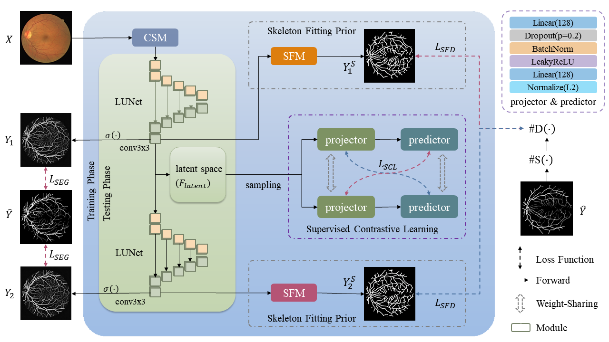

# SkelCon
PyTorch implementation for our paper on TMI2022:    
Y. Tan, K. -F. Yang, S. -X. Zhao and Y. -J. Li, "Retinal Vessel Segmentation with Skeletal Prior and Contrastive Loss," in IEEE Transactions on Medical Imaging, doi: 10.1109/TMI.2022.3161681.

WebPage:https://ieeexplore.ieee.org/abstract/document/9740153


## Figures
<!--  -->


## Structure
/code
-   Data Augmentation Method:       code\color_space_mixture.py
-   Sample Contrastive Learning:    code\sample_contrastive_learning.py
-   Skeletal Prior based Network:   code\model_skelcon.py

/onnx
-   Pytorch trained weights from DRIVE, STARE, CHASE DB1, and HRF datasets.
-   The *.onnx weights can be directly used to extract vessels from fundus images, see onnx\infer.py

/results
-   segmentation results for popular datasets:              results\popular
-   segmentation results for cross-dataset-validation:      results\generalization


## Contact
For any questions, please contact me. 
And my e-mails are 
-   tyb311@qq.com
-   tyb@std.uestc.edu.cn


## Citation
If you use this codes in your research, please cite the paper:
```BibTex
@article{tan2022retinal,
  title={Retinal Vessel Segmentation with Skeletal Prior and Contrastive Loss},
  author={Tan, Yubo and Yang, Kai-Fu and Zhao, Shi-Xuan and Li, Yong-Jie},
  journal={IEEE Transactions on Medical Imaging},
  year={2022},
  doi={10.1109/TMI.2022.3161681}
  publisher={IEEE}
}
```